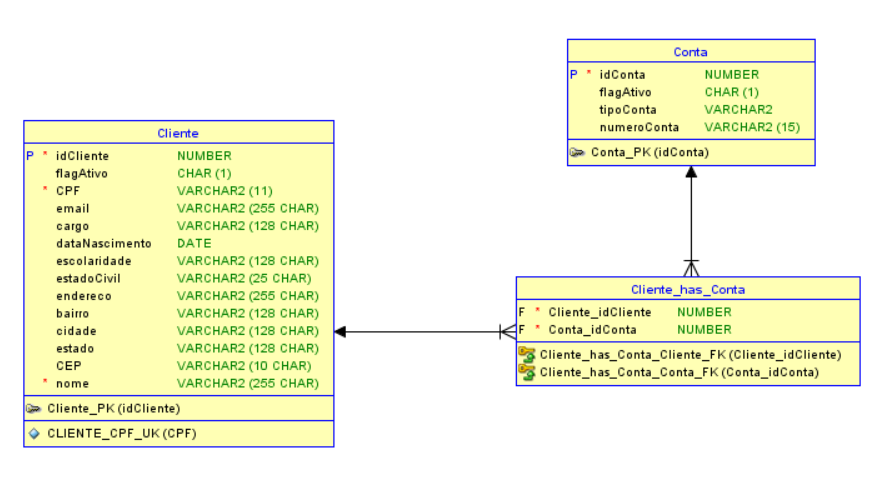

## Desafio Backend
### Complete o desafio abaixo para a gente conhecer mais sobre você:

O desafio é criar uma API REST em **Java** que realiza o CRUD de clientes e contas com o modelo de dados abaixo. 

### Diferenciais
- Clean Code
- Teste Unitário
- Controle de acesso
- API Documentada
- Bean Validation
- Docker

> **PS:** fique à vontade para incluir outros itens diferenciais. Todo o seu conhecimento apresentado no desafio contará para a sua avaliação.

### Como submeter o desafio
Você deve enviar sua solução para um repositório privado no GitHub e adicionar o usuário git.hub@etaure.com.br como colaborador para que possamos avaliar seu trabalho.
Ao finalizar envie um email para recrutamento@etaure.com.br com nome, telefone para contato e link do repositório.