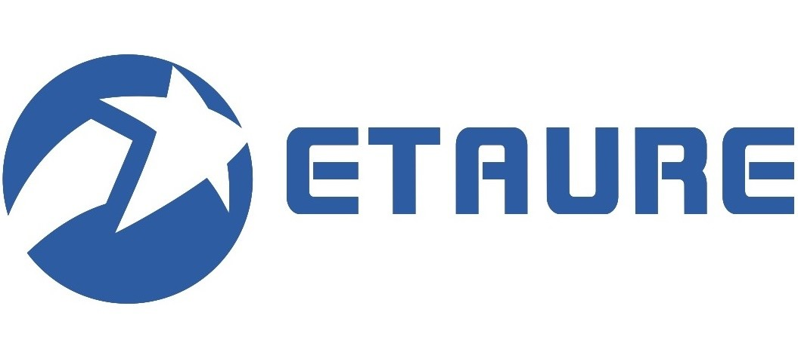
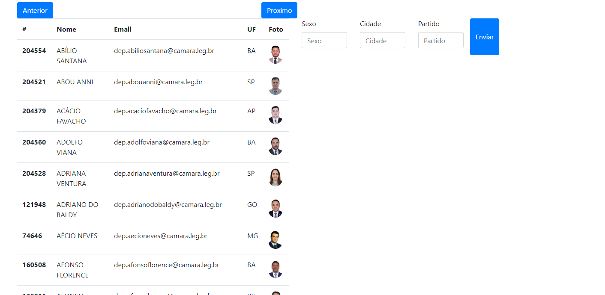

## Desafio Backend
### Complete o desafio abaixo para a gente conhecer mais sobre você:

### Objetivos do desafio:

1.Avaliar o raciocínio lógico utilizado pelo candidato para resolver problemas;

2.Avaliar as habilidades do candidato em programação. 

### Situação problema:

Obs.: A situação apresentada abaixo é fictícia, construida apenas para elucidar o desafio proposto. 

A Câmara dos Deputados contratou a ETAURE para desenvolver o sistema chamado “Dados Abertos”, que permite qualquer cidadão obter informações sobre os Deputados brasileiros sem precisar ir pessoalmente ao órgão público ou ter que apresentar requerimento formal de acesso aos dados.

Para isso, a Câmara entregou as fontes de dados em arquivos JSON e solicitou que a ETAURE criasse um sistema que filtre os dados, para que o usuário possa pesquisar informações dos Deputados selecionando os filtros que lhe interessam, como por exemplo, o Estado, cidade, sexo, partido, etc. 

Para conseguir executar esse projeto, a ETAURE terá que contratar um novo Programador/Analista, pois toda a equipe atual está alocada em projetos. Para isso, propôs um desafio aos candidatos à vaga, a fim de saber se eles terão facilidade para lidar com o projeto.

### Abaixo estão as instruções para execução do desafio:

1.Aos candidados que pleitearem vagas de programador Backend e analistas de sistemas, desenvolva os algoritmos de acesso e manipulação dos dados e crie uma forma de consultá-los, por exemplo um mecanismo de entrada e saída de dados via console por meio de sua “cidade”, “sexo” e “partido”;

2.Para programadores Fullstack e Frontend é necessário, além dos algoritmos de acesso e manipulação dos dados, desenvolver uma interface gráfica que servirá como mecanismo de entrada e saída de dados;

3.Os dados, arquivos que acompanham este documento, estão divididos em 7 arquivos JSON que precisam ser processados juntos. 

### Como Submeter o desafio:

Você deve enviar sua solução para um repositório privado no GitHub e adicionar o usuário “etaure” como colaborador, para que possamos avaliar seu trabalho. Ao finalizar, envie um email para recrutamento@etaure.com.br com nome, telefone para contato e link do repositório.

### Segue um exemplo de aplicação feita por nossa equipe:

